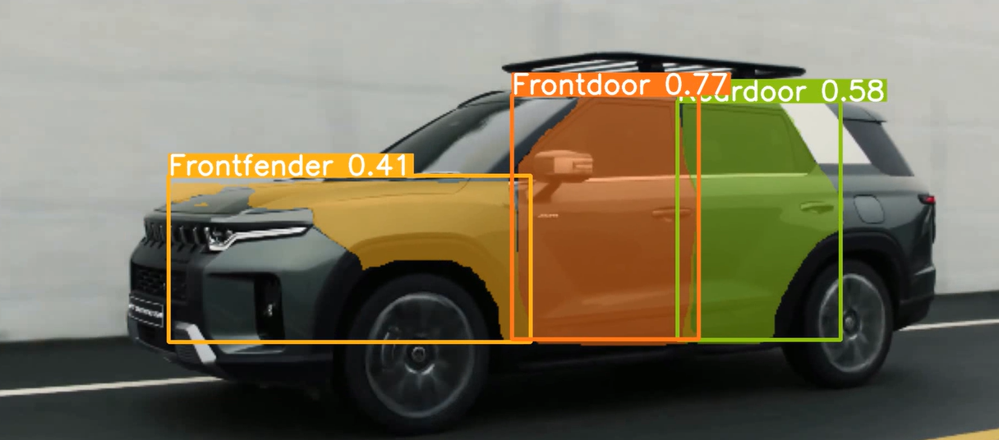
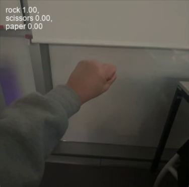

# Project_Yolov8
Yolov8을 활용한 이미지, 동영상 객체 감지 모델 구현

   

   

## Object

Yolov8 모델을 활용하여 개발된 차량 데이터셋 이미지와 동영상을 실시간으로 인식하는 프로그램입니다. 

본 모델은 높은 성능의 객체 감지 및 추적 기능을 제공하며, 자동차 관련 부품 인식 프로그램에 적용될 수 있습니다

더불어, 기존 Yolo 단순 실행 시 인식 정확도에 기반하여 성능향상을 위한 테스트를 진행합니다.

## Dataset
- car : [roboflow] https://universe.roboflow.com/ds/Hxie9vewYe?key=hbcFa5gtFP
- rps : [roboflow] https://public.roboflow.com/ds/orVECZFnvV?key=sDLGP3XRMk 

## Libraries used
- yolo segment
- yaml

## File explanation

- Dataset
- my_seg : yolo segment predict model
- .ipynb : Working Flow
- .test : Visual Studio test environment

## Version

- python 3.12.2
- numpy 1.26.4
- pandas 2.2.1
- opencv-python 4.9.0.80
- ultralytics 8.1.19

## Result

- train 데이터와 val 데이터의 loss 값이 하향하거나 precision 상향한다는 전제 하에 epoch 세부 조정하여 성능 향상을 유도할 수 있다. 
- 학습 데이터를 Raw 데이터의 해상도와 프레임 크기를 일치시켰을 때 소폭 성능이 향상됨을 확인하였다.
- 인식 품목 수(바퀴, 사이드미러, 범퍼) 가지 수를 축소하였을 때 인식 성능이 개선되었다.  
